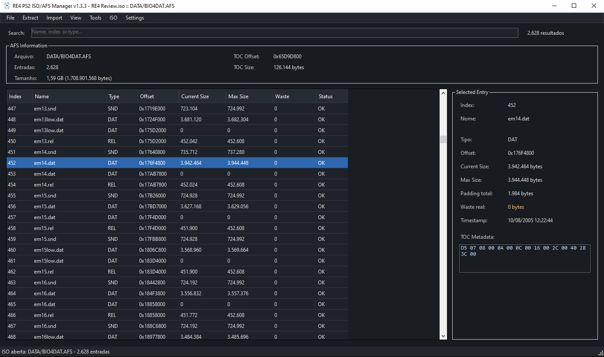

# RE4 PS2 ISO/AFS Manager

A Windows tool for working with **AFS archives and PlayStation 2 ISO
images**, developed primarily for **Resident Evil 4 (PS2) modding**.

The project was created to provide a more convenient workflow for
extracting, replacing, analyzing, and rebuilding files inside AFS
archives --- including AFS files stored directly inside a PS2 ISO.

## Screenshot



## Features

- Open standalone `.AFS` archives and PS2 `.ISO` images.
- Automatically detect AFS archives inside an ISO.
- Drag & drop support for opening ISO/AFS files and replacing entries.
- Extract one, multiple, or all files.
- Import individual files, folders, or replace the current AFS.
- Import files larger than the original allocated size using automatic AFS rebuild/realocation when possible.
- Export the currently opened AFS from an ISO.
- Compare two AFS archives and detect changed files.
- Verify AFS integrity and detect structural problems.
- Rebuild/compact AFS archives while preserving indexes, TOC data, timestamps, and `0x800` alignment.
- Expand supported ISO layouts when an internal AFS needs additional space.
- Detect external modifications to the currently opened ISO/AFS.
- Recent files history and context menu actions.
- English and Portuguese interface.
- Light and dark themes.

## Batch Extraction

Files extracted in batch include the original AFS index in their names:

```text
000507_em1e.snd
000508_em1e.dat
```

An `afs_manifest.txt` is also generated so files can be reliably imported back into their original entries.

## Requirements

-   Windows
-   .NET 6
-   Windows Forms

## Building

Open the project in Visual Studio with the **.NET desktop development** workload installed.

Target framework:

```text
net6.0-windows
```

Then build the solution normally.

## Compatibility

The tool was developed and tested primarily with **Resident Evil 4 for PlayStation 2**.

Other games may use different AFS variants, so compatibility is not guaranteed.

> Always keep a backup before modifying an ISO or AFS archive.

## Disclaimer

This is an unofficial modding tool and is not affiliated with or
endorsed by Capcom, Sony, or any other rights holder.

No game files, copyrighted game assets, or disc images are included with
this project.

## Contributing

Bug reports, compatibility findings, and improvements are welcome.

If you test the tool with other AFS-based PlayStation 2 games, please
include information about the game, AFS structure, and any differences
you observe.
